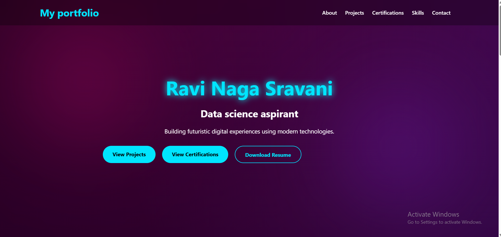
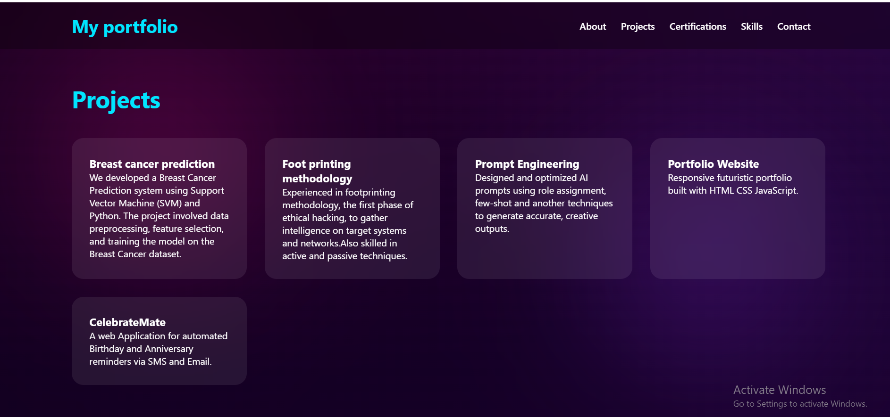
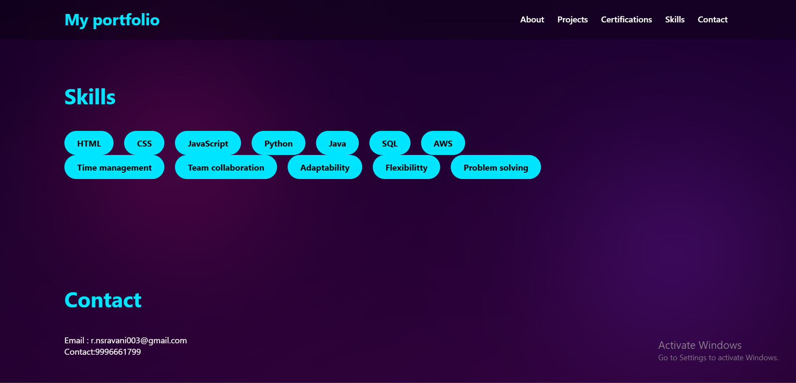
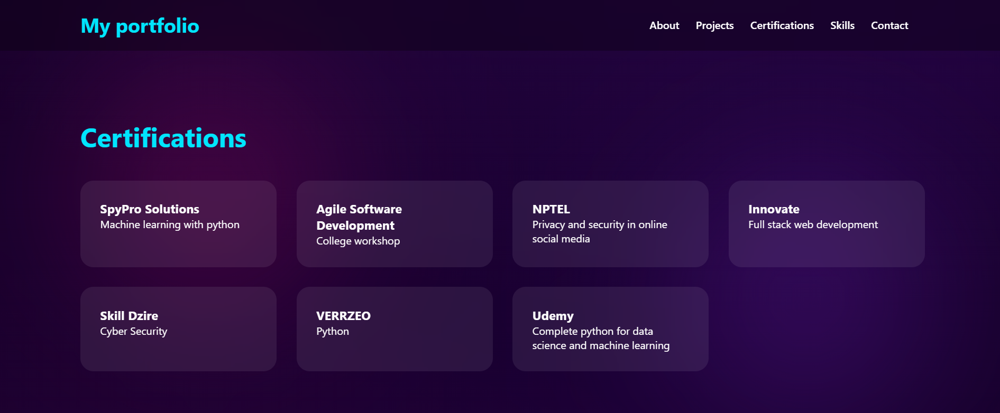

# 🌐 Personal Portfolio Website

## 📸 Screenshots

### Home Page



### Projects


## 📸 Screenshots

### skils and contacts



### certificates



## 📌 About the Project

This is my personal portfolio website built using HTML, CSS, and JavaScript. It showcases my profile, technical skills, projects, certifications, resume, and contact information in a clean and responsive design.

The website includes a Dark theme, smooth scrolling, and scroll reveal animations to enhance the user experience.

## 📂 Project Structure

```text
Portfolio/
│
├── index.html
├── style.css
├── script.js
├── resume.pdf
├── README.md
│
├── certificates/
│   ├── machine-learning.pdf
│   ├── agile-software-development.pdf
│   ├── full-stack-web-development.pdf
│   ├── cyber-security.pdf
│   ├── python.pdf
│   └── data-science-machine-learning.pdf
│
└── images/
    ├── home.png
    ├── about.png
    ├── projects.png
    ├── certifications.png
    ├── skills.png
    └── contact.png
```

## ✨ Features 

- Responsive portfolio website
- About Me section
- Projects section
- Certifications section
- Technical and Soft Skills
- Resume download option
- Contact information with GitHub and LinkedIn links
- Smooth scrolling navigation
- Scroll reveal animations

## 🛠️ Technologies Used 
- HTML5
- CSS3
- JavaScript

##  🚀 How to Run the Project
Clone this repository:
git clone https://github.com/sravani-222/portfolio.git
Open the project folder.
Open index.html in your browser or use the Live Server extension in Visual Studio Code.

## 📖 Website Sections
- 🏠 Home
- 👤 About Me
- 💼 Projects
- 📜 Certifications
- 💡 Skills
- 📄 Resume Download
- 📞 Contact

## 📄 Resume

The repository includes my latest resume as resume.pdf.

Visitors can download it directly from the portfolio website using the Download Resume button.
## Certifications
 Contains images of certifaces
 ```text
Portfolio/
│
├── certificates/
│   ├── machine-learning.pdf
│   ├── agile-software-development.pdf
│   ├── nptel-privacy-security.pdf
│   ├── full-stack-web-development.pdf
│   ├── cyber-security.pdf
│   ├── python.pdf
│   └── data-science-machine-learning.pdf
```
## 🔮 Future Improvements
- Improve mobile navigation
- Add more animations
- Connect the contact form with EmailJS
- Deploy the portfolio using GitHub Pages

### 📄 License - This project is created for learning and personal portfolio purposes.
